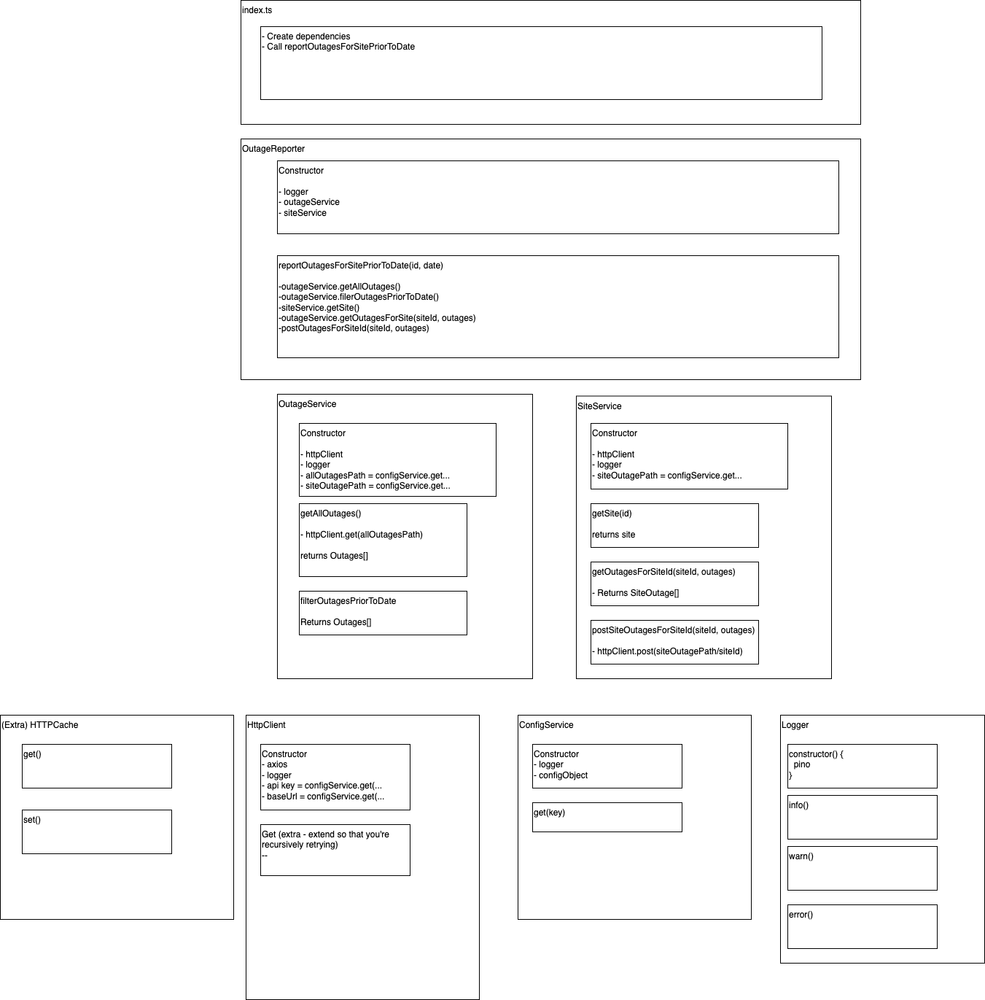

## Site Outage Info Reporter

### Dependencies

- Install and use Node 16 (older/newer versions may cause support issues)
- Initially please install dependencies using the following command in a terminal window

```
$ yarn
```

- Copy the file .env.example, and rename your new file to .env
- Amend the values in this new file to reflect the values that are required, please ask your team for details.

### Running locally

- Open a terminal window and run the following command

```
$ yarn run start
```

### Running unit tests

- Open a terminal window and run the following command

```
$ yarn run test
```

### Running functional tests

```
$ yarn run test:functional
```

### Development process

- Please see [todo](./todo.md) file for an idea of my thought process / next steps!
- 
